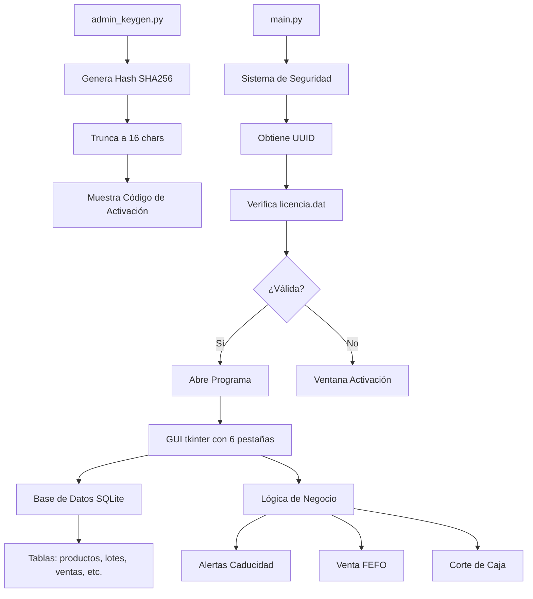

# Plan de Desarrollo del Sistema ERP/POS Veterinario

## Arquitectura General

El sistema se divide en dos componentes principales:

1. **admin_keygen.py**: Script de consola para generar licencias basado en UUID de hardware.
2. **main.py**: Aplicación principal con GUI tkinter, base de datos SQLite y funcionalidades completas.

### Diagrama de Arquitectura

## Esquema de Base de Datos

- **productos**: codigo (TEXT PK), nombre (TEXT), categoria (TEXT), precio_publico (REAL), precio_mayoreo (REAL), costo_referencia (REAL), stock_minimo (INTEGER)
- **lotes**: id (INTEGER PK), codigo_producto (TEXT FK), cantidad (INTEGER), fecha_caducidad (TEXT)
- **ventas**: id (INTEGER PK), fecha (TEXT), folio (TEXT), total (REAL), tipo_precio (TEXT)
- **detalle_venta**: id (INTEGER PK), venta_id (INTEGER FK), codigo_producto (TEXT), cantidad (INTEGER), precio_unitario (REAL), subtotal (REAL)
- **pacientes**: id (INTEGER PK), nombre (TEXT), especie (TEXT), raza (TEXT), dueno (TEXT), telefono (TEXT), fecha_registro (TEXT)
- **historial_clinico**: id (INTEGER PK), paciente_id (INTEGER FK), fecha (TEXT), motivo (TEXT), diagnostico (TEXT), peso (REAL)
- **movimientos_caja**: id (INTEGER PK), fecha (TEXT), tipo (TEXT), motivo (TEXT), monto (REAL)
- **proveedores**: id (INTEGER PK), empresa (TEXT), telefono (TEXT)
- **costos_proveedores**: id (INTEGER PK), codigo_producto (TEXT), proveedor_id (INTEGER FK), costo_ofrecido (REAL)

## Flujo de Licenciamiento

1. Al iniciar main.py, obtener UUID con uuid.getnode()
2. Buscar archivo licencia.dat
3. Si existe, leer clave, recalcular hash con UUID + SECRET_KEY
4. Comparar: si coincide, continuar; sino, mostrar ventana bloqueante
5. Si no existe, mostrar ventana para ingresar código de activación
6. Si correcto, crear licencia.dat con la clave

## Interfaz Gráfica

6 pestañas en tkinter con estilo alto contraste:
- Fuentes Arial 12+, botones amplios, colores claros
- Título: "CLÍNICA VETERINARIA BEETHOVEN"

### Pestañas:
1. **CAJA**: Input código barras, selector precio, total gigante, botón retiro, F12 cobrar
2. **PACIENTES**: Buscador, tabla resultados, historial clínico, botón nueva consulta
3. **INVENTARIO**: CRUD productos, tabla lotes con colores (rojo caducidad, amarillo stock bajo), respaldo USB
4. **PROVEEDORES**: Comparador precios, ganancia potencial
5. **FINANZAS**: Dashboard día (ingresos, gastos, fondo, ganancia)
6. **ALERTAS**: Tabla urgencias (caducidad, stock bajo)

## Lógica de Negocio

- **Alertas Inicio**: Revisar lotes con caducidad <= 30 días, mostrar warning
- **Venta FEFO**: Descontar del lote más antiguo
- **Corte Caja**: (Ventas Hoy - Retiros Hoy) - 500 = Ganancia a Retirar
- Validaciones: No vender sin stock (excepto servicios), manejo errores

## Implementación

El código se implementará en Python con:
- tkinter para GUI
- sqlite3 para BD
- shutil para respaldos
- uuid y hashlib para seguridad
- Manejo robusto de errores y validaciones